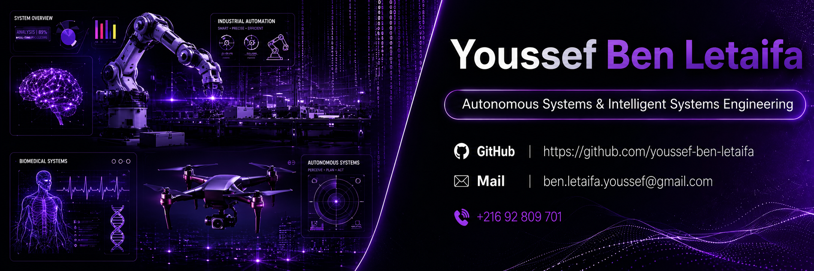

<div align="center">

<!--  ╔══════════════════════════════════════════════════════════════════╗
      ║  BANNER — commit banner.png to your repo root, then reference  ║
      ║  it as shown below. Replace URL if you host it elsewhere.      ║
      ╚══════════════════════════════════════════════════════════════════╝ -->



<br/>

[](https://benletaifayoussef.lovable.app/)&nbsp;
[](https://www.linkedin.com/in/youssefbenletaifa/)&nbsp;
[](mailto:ben.letaifa.youssef@gmail.com)&nbsp;
[](https://github.com/youssef-ben-letaifa)

<br/>


</div>

<br/>


<br/>

## ◈ &nbsp; Profile

<table>
<tr>
<td width="57%" valign="top">

I'm an **Autonomous Systems & Intelligent Systems Engineer** with a foundation in Biomedical Engineering.

My work spans the full hardware-to-intelligence stack — from **bare-metal embedded firmware** and **motor control algorithms** to **AI perception pipelines** and **autonomous vehicle architectures**.

I design and build systems that operate in the real world, not just in simulations:

- &nbsp; Autonomous driving · perception · decision-making
- &nbsp; Electric vehicle powertrain & BMS control
- &nbsp; Robotics, ROS2 & motion planning
-  &nbsp; Intelligent transportation & cooperative driving
- &nbsp; Industrial automation & embedded AI
- &nbsp; Biomedical AI & biosignal processing

</td>
<td width="43%" valign="top">

```yaml
name:     Youssef Ben Letaifa
role:     Autonomous Systems • Control Engineering
base:     Sousse, Tunisia

domains:
  - Autonomous Systems
  - Control Engineering
  - Electric Vehicles
  - Robotics & ROS2
  - Embedded AI
  - Intelligent Transport
  - Industrial Automation
  - Biomedical Technology

status:   Open to Collaboration
```

</td>
</tr>
</table>

<br/>


<br/>

## ◈ &nbsp; Specialization Matrix

<div align="center">

|  AUTONOMOUS SYSTEMS |  ELECTRIC VEHICLES | ROBOTICS |  INDUSTRIAL AUTOMATION |
|:---|:---|:---|:---|
| Perception & Sensor Fusion | EV Powertrain Control | ROS / ROS2 Architecture | SCADA / PLC Integration |
| Path Planning & Navigation | BMS Design & Management | Kinematics & Dynamics | Edge AI Deployment |
| SLAM & Localization | FOC Motor Control | Manipulation & Motion Planning | Predictive Maintenance |
| Embedded Autonomy Stack | Charging System Design | Sim-to-Real Transfer | Industrial Computer Vision |

|  EMBEDDED AI |  INTELLIGENT TRANSPORT | BIOMEDICAL TECH |  CONTROL ENGINEERING |
|:---|:---|:---|:---|
| TFLite / ONNX Runtime | V2X Communication | ECG / EEG Signal Processing | PID · MPC · LQR |
| Edge Inference Optimization | Traffic Flow Intelligence | Medical Device Firmware | State Space Modeling |
| MCU / FPGA Deployment | Cooperative Driving Systems | Biosignal AI & Classification | Digital Control Systems |
| Real-Time AI Pipelines | Smart Mobility Architecture | Wearable Health AI | System Identification |

</div>

<br/>


<br/>

## ◈ &nbsp; Tech Stack

<div align="center">

**AI & Deep Learning**


**Embedded & Hardware**


**Software & Backend**


**Data & DevOps**


</div>

<br/>


<br/>

## ◈ &nbsp; GitHub Analytics

<div align="center">


&nbsp;&nbsp;


<br/>


</div>

<br/>


<br/>

## ◈ &nbsp; Achievements

<div align="center">

</div>

<br/>


<br/>

## ◈ &nbsp; Contribution Graph

<div align="center">

</div>

<br/>


<br/>

## ◈ &nbsp; Current System

```python
class YoussefBenLetaifa:
    role        = "Autonomous Systems & Intelligent Systems Engineer"
    base        = "Sousse, Tunisia"
    background  = "Biomedical Engineering"

    systems = {
        "autonomous_driving":    ["Perception", "SLAM", "Path Planning", "Sensor Fusion"],
        "electric_vehicles":     ["Powertrain Control", "BMS", "FOC", "Charging Systems"],
        "robotics":              ["ROS2", "Kinematics", "Motion Planning", "Manipulation"],
        "embedded_ai":           ["TFLite", "ONNX", "Edge Inference", "MCU Deployment"],
        "intelligent_transport": ["V2X", "Traffic AI", "Smart Mobility", "Cooperative Driving"],
        "biomedical_tech":       ["ECG/EEG", "Medical AI", "Biosignal Processing", "Wearables"],
        "industrial_automation": ["SCADA", "PLC", "Computer Vision", "Predictive Maintenance"],
        "control_engineering":   ["PID", "MPC", "LQR", "State-Space", "Digital Control"],
    }

    stack    = ["Python", "C/C++", "PyTorch", "ROS2", "FastAPI", "Docker", "Linux"]

    motto    = "From embedded firmware to full-stack AI — systems that work in the real world."

    def available_for(self):
        return [
            "Autonomous Systems Research & Development",
            "EV Powertrain & Robotics Engineering",
            "AI Consulting & Open Source Collaboration",
        ]
```

<br/>


<br/>

## ◈ &nbsp; Let's Connect

<div align="center">

*Building the intelligent systems of tomorrow — from embedded control to full autonomy.*

<br/>

[](https://benletaifayoussef.lovable.app/)&nbsp;
[](https://www.linkedin.com/in/youssefbenletaifa/)&nbsp;
[](mailto:ben.letaifa.youssef@gmail.com)

<br/><br/>


<br/><br/>


</div>
