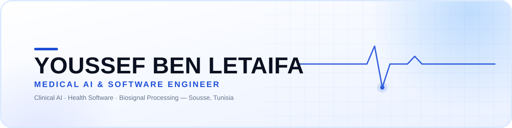

<div align="center">



<br/>

[](https://benletaifayoussef.lovable.app/)&nbsp;
[](https://www.linkedin.com/in/youssefbenletaifa/)&nbsp;
[](mailto:ben.letaifa.youssef@gmail.com)&nbsp;
[](https://github.com/youssef-ben-letaifa)

<br/>


</div>

<br/>


<br/>

## Profile

<table>
<tr>
<td width="62%" valign="top">

I build AI and software for healthcare — from biosignal processing pipelines to clinical decision-support tools. A foundation in biomedical engineering grounds a practice focused on turning medical data into reliable, deployable software.

I work at the intersection of applied AI and health software, focused on medical imaging, biosignal analysis, and clinical-grade system design.

</td>
<td width="38%" valign="top">

```yaml
name:       Youssef Ben Letaifa
role:       Medical AI &
            Software Engineer
background: Biomedical Engineering
location:   Sousse, Tunisia
focus:      Medical AI · Health
            Software · Biosignals
status:     Open to collaboration
```

</td>
</tr>
</table>

## Core Expertise

| Domain | Key Capabilities |
|:---|:---|
| **Medical AI & Diagnostics** | Medical imaging AI (CT / MRI / X-ray), diagnostic decision support, disease classification models, predictive risk scoring |
| **Health Software Engineering** | Clinical software systems, HL7 / FHIR integration, EHR-connected applications, medical device software (IEC 62304-aligned) |
| **Biosignal Processing** | ECG / EEG signal processing, biosignal AI & classification, real-time patient monitoring, wearable health AI |
| **Clinical Data & MLOps** | Medical data pipelines, model validation & regulatory readiness, privacy-aware design (HIPAA / GDPR), clinical AI deployment |

## Tech Stack

<div align="center">

**AI &amp; Deep Learning**
<br/>


<br/><br/>

**Software &amp; Backend**
<br/>


<br/><br/>

**Data &amp; DevOps**
<br/>


</div>

<br/>


<br/>

## GitHub Activity

<div align="center">


</div>

<div align="center">

</div>

<br/>


<br/>

<div align="center">

## Let's Connect

Open to medical AI research, health software engineering, and clinical AI consulting collaborations.

[](https://benletaifayoussef.lovable.app/)&nbsp;
[](https://www.linkedin.com/in/youssefbenletaifa/)&nbsp;
[](mailto:ben.letaifa.youssef@gmail.com)

<br/><br/>


</div>
